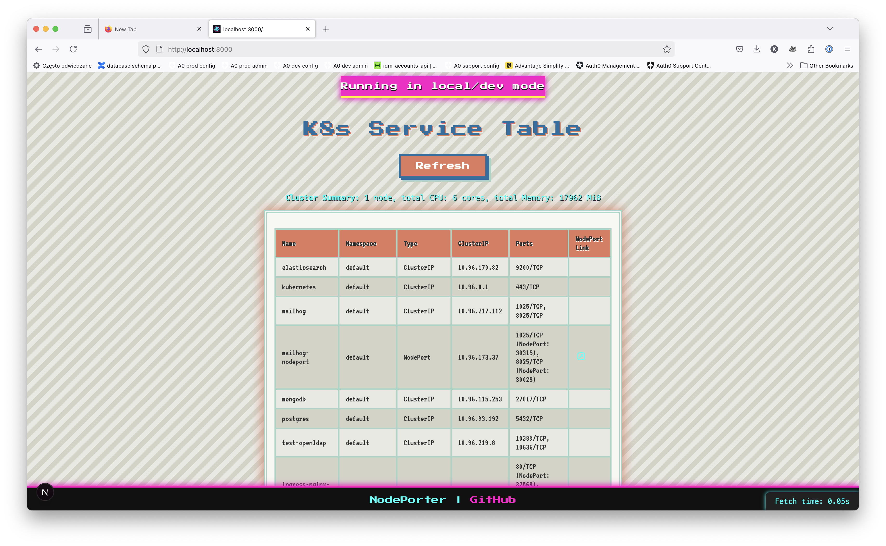

# NodePorter


 Kubernetes Dashboard

A modern dashboard for managing your local home lab Kubernetes cluster—**no hosts file editing or custom DNS required!**

---

> **Note:** This project was created and iteratively developed using AI assistance, enabling rapid prototyping and high-quality automation.

---

## 🚀 Project Background

This project was conceived as an experiment to leverage generative AI (GenAI) for real-world software development, while also solving a common pain point for home lab Kubernetes users:

> **How can I access Kubernetes services from my laptop, without editing `/etc/hosts` or running my own DNS?**

NodePorter provides a user-friendly, retro-styled dashboard that discovers and displays all your cluster services and node endpoints, making it easy to access NodePorts, monitor cluster health, and more—all with zero manual networking hacks.

---

## ✨ Features

- **Environment-aware banner:** Instantly see if you’re running in-cluster or local/dev mode.
- **Kubernetes Service Table:** List all services, types, ports, and direct NodePort links.
- **Cluster Node Summary:** See node count, total CPU, and memory at a glance.
- **No hosts file or DNS hacks:** Access services using real node IPs—no manual setup required.
- **Retro UI:** Styled with 8-bit fonts and vibrant colors for fun and clarity.
- **AI-assisted development:** The codebase was built and refactored with the help of generative AI tools for rapid iteration.

---

## 🛠️ Getting Started

### Prerequisites

- Node.js v18+ (tested on v22)
- Access to a Kubernetes cluster (local or remote)

### Installation

```sh
npm install
```

### Running the Dashboard

```sh
npm run dev
```

- Open [http://localhost:3000](http://localhost:3000) in your browser.

### Running Tests

```sh
npm run test
```

---

## 🏡 Home Lab Use Case

- Deploy this dashboard to your local cluster (e.g., k3s, kind, minikube).
- No need to edit `/etc/hosts` or run CoreDNS tweaks—just use the NodePort links provided.
- Works great for small teams or home labs wanting simple service access and cluster visibility.

---

## 🤖 GenAI Approach

This project was iteratively built and improved using generative AI (Cascade, GPT-4, etc.), showcasing:

- Rapid prototyping of UI and API features
- Automated code refactoring and dependency management
- AI-driven troubleshooting and test creation

---

## 📦 Project Structure

- `pages/` — Next.js pages and API routes (including `api/` for backend endpoints)
- `public/` — Static assets (icons, manifest, etc.)
- `styles/` — Global and component CSS
- `utils/` — Utility/helper functions (e.g., logging)
- `__tests__/` — Jest tests for API and frontend
- `ops/` — Deployment and Dockerization scripts

---

## 🙏 Credits

- [Next.js](https://nextjs.org/)
- [@kubernetes/client-node](https://github.com/kubernetes-client/javascript)
- [styled-components](https://styled-components.com/)
- [@fontsource/press-start-2p](https://fontsource.org/fonts/press-start-2p)
- GenAI for development support

---

## 📝 License

MIT
